  

  

 

Hi, I'm Liu Zhuowen, a second-year M.S. student in the **Cybersecurity Lab, Graduate School of Advanced Science and Technology, JAIST**.

My research focuses on **agent security in security operations (SOC)**, with the goal of putting LLM agents to work in real-world security operations safely and reliably. Alongside this, I work on **safeguarding China’s intangible cultural heritage**, using today’s most capable AI to help traditional culture be preserved and passed on digitally.

> [!TIP]
> Looking for **security / AI security roles (class of 2027)**: security research · security operations · AI security engineering.

 

## 🔬 Research

<b>One line per project</b>

- **In progress · Premature verdicts under forged evidence**: ~10k episodes across open models from 0.5B to 72B (Qwen2.5, Qwen3, Llama-3.1, Meta-SecAlign). Models large enough to conclude judge 30–36 of 36 attacks benign under forged logs; Qwen2.5-72B accepts a story after checking 1.1 sources on average. Now pre-registering corroboration-aware training that uses no attack samples.
- **[HESP](https://github.com/lzwhehe/HESP)** (first author): the model reads the logs, a controller decides. After a log-format change, “7B reads, controller decides” resolves all 48 cases; a *reader-trust* rule brings missed attacks to 0 under every attack tested.
- **[Passing the Test You Trained On](https://github.com/lzwhehe/benign-instruction-bench)** (paper draft): rankings of 15 prompt-injection detectors barely transfer across benchmarks (Kendall τ 0.01–0.31); scores mostly reflect how close a benchmark is to a detector's training data.
- **[Ku Shulan paste-up papercut generation](https://github.com/lzwhehe/kushulan-papercut-blora)** (co-first author, under review at *npj Heritage Science*): recover the paper palette and cut lines from her works, then fine-tune Qwen-Image-Edit; line recall 0.97.

## 🧰 Toolkit

  

| Area | What I use |
| :-- | :-- |
| **Agent&nbsp;security** | indirect prompt injection · evidence forgery · adaptive attacks · reader trust / cross-source corroboration · OWASP LLM Top 10 |
| **Evaluation** | pre-registered experiments · write-ahead journals & independent verifiers · AgentDojo · τ-bench · BIPIA · SigmaHQ / ATT&CK |
| **LLM** | vLLM · Ollama · local Qwen2.5 / Qwen3 / Llama-3.1 · MCP · LoRA fine-tuning (Qwen-Image-Edit, SDXL) |
| **Web&nbsp;security** | OWASP Top 10 · Burp Suite · SQLMap · Nmap · Xray |

 
Japan Advanced Institute of Science and Technology (JAIST) · Ishikawa, Japan · <i>let the model read, not decide.</i>

