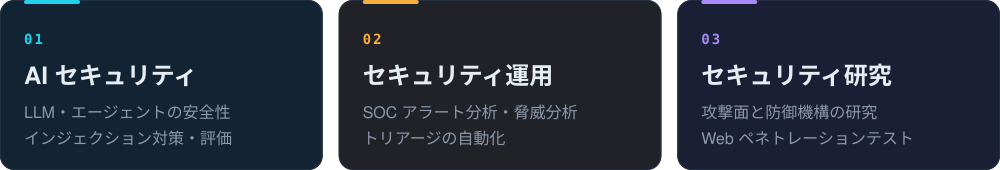

  

  

 

こんにちは、劉卓文です。**北陸先端科学技術大学院大学（JAIST）先端科学技術専攻・サイバーセキュリティ研究室**の修士 2 年に在籍しています。

研究テーマは **SOC（セキュリティ運用）におけるエージェントのセキュリティ**で、LLM エージェントを実際のセキュリティ運用の現場に安全かつ確実に導入できるようにすることを目指しています。また、**中国の無形文化遺産の保護**にも取り組んでおり、最先端の AI 技術を活かして、伝統文化のデジタルな保存と継承を支えることに力を入れています。

## 🎯 希望職種

**2027 年卒**（2027 年 3 月修士修了予定）。セキュリティ / AI セキュリティ職を探しています：

## 🔬 Research

<b>各プロジェクトの概要</b>

- **進行中・偽造証拠下での早すぎる判断**：0.5B〜72B のオープンモデル（Qwen2.5、Qwen3、Llama-3.1、Meta-SecAlign）で約 1 万エピソードを測定。結論を出せる大型モデルは、偽造ログのもとで 36 件の攻撃のうち 30〜36 件を良性と判定し、Qwen2.5-72B は平均 1.1 個の情報源しか確認せずに受け入れます。攻撃サンプルを一切使わない「裏付け重視」学習を事前登録中です。
- **[HESP](https://github.com/lzwhehe/HESP)**（筆頭著者）：モデルはログを読むだけ、判断はコントローラが行います。ログ形式の変更後も「7B が読み、コントローラが判断」で 48 件すべてを解決。「リーダー信頼」ルールにより、検証したすべての攻撃で見逃しを 0 にしました。
- **[Passing the Test You Trained On](https://github.com/lzwhehe/benign-instruction-bench)**（論文草稿）：15 種のプロンプトインジェクション検知器の順位はベンチマーク間でほとんど一致せず（Kendall τ 0.01〜0.31）、スコアは主にベンチマークと学習データの近さを反映していました。
- **[庫淑蘭の彩貼り切り紙の生成](https://github.com/lzwhehe/kushulan-papercut-blora)**（共同筆頭著者、*npj Heritage Science* 査読中）：作品から色紙パレットと切り線を自動復元し、Qwen-Image-Edit をファインチューニング。線再現率 0.97。

## 🧰 Toolkit

  

| 分野 | 使っているもの |
| :-- | :-- |
| **Agent&nbsp;セキュリティ** | 間接プロンプトインジェクション・証拠偽造・適応的攻撃・リーダー信頼 / 複数情報源による裏付け・OWASP LLM Top 10 |
| **評価** | 事前登録実験・先行書き込みログと独立検証器・AgentDojo・τ-bench・BIPIA・SigmaHQ / ATT&CK |
| **LLM** | vLLM・Ollama・Qwen2.5 / Qwen3 / Llama-3.1 のローカル運用・MCP・LoRA ファインチューニング（Qwen-Image-Edit、SDXL） |
| **Web&nbsp;セキュリティ** | OWASP Top 10・Burp Suite・SQLMap・Nmap・Xray |

 
北陸先端科学技術大学院大学（JAIST）· 石川県 · <i>let the model read, not decide.</i>

